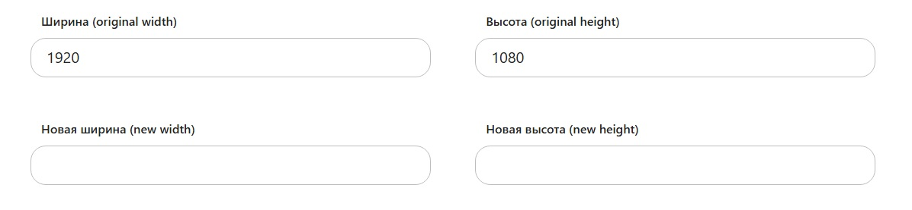

# Калькулятор соотношения сторон (aspect-ratio-calculator)



Удобный калькулятор соотношения сторон (англ. — Aspect Ratio Calculator), который позволяет вычислить значение при изменении одной из величин. Часто такая необходимость возникает, например, при вычислении размеров изображений для размещения на сайте или в приложении.

[ДЕМО](https://uxuimedia.github.io/tools/aspect-ratio/)

## HTML

```html
<div>
			<div class="box">
				<label for="initW">
				<span>Ширина (original width)</span>
				<input type="number" min="1" id="initial-width">
				</label><label for="iniH">
				<span>Высота (original height)</span>
				<input type="number" min="1" id="initial-height">
				</label>
			</div>
			<div class="box">
				<label for="newW">
				<span>Новая ширина (new width)</span>
				<input type="number" min="1" id="new-width">
				</label><label for="newH">
				<span>Новая высота (new height)</span>
				<input type="number" min="1" id="new-height">
				</label>
			</div>
</div>
```

## JavaScript

```js
/*
 * JAVASCRIPT
 */

//Formulas:
//New height = new width / (original width / original height).
//New width = (original width / original height) * new height.

//Initial values:
var initialWidth = 1920,
    initialHeight = 1080,
    newWidth,
    newHeight;

$("#initial-width").val(initialWidth);
$("#initial-height").val(initialHeight);

//Get new values:
function getValues() {
    initialWidth = $("#initial-width").val();
    initialHeight = $("#initial-height").val();
    newWidth = $("#new-width").val();
    newHeight = $("#new-height").val();
};

//Aspect ratio:
function getAspectRatio() {
    //Formula: "Aspect Ratio = Width / Height".
    return aspectRatio = initialWidth / initialHeight;
};

//Get new height:
$("#new-width").on("change keyup", function() {
    //Refresh data.
    getValues();
    getAspectRatio();
    //Formula: "Height = Width / Aspect Ratio".
    newHeight = Math.round(newWidth / aspectRatio);
    //Output:
    $("#new-height").val(newHeight);
});

//Get new width:
$("#new-height").on("change keyup", function() {
    //Refresh data.
    getValues();
    getAspectRatio();
    //Formula: "Width = Aspect Ratio * Height".
    newWidth = Math.round(newHeight * aspectRatio);
    //Output:
    $("#new-width").val(newWidth);
});

//Reset:
$("#initial-width, #initial-height").on("change keyup", function() {
    //Output:
    $("#new-width").val("");
    $("#new-height").val("");
});
```

## CSS

```css
.box-block {
	width: 100%;
	max-width: 720px;
	margin: 0 auto;
	padding: 0 20px;
}

.box {
    background: #ffffff;
    padding: 20px 5% 26px 5%;
    border-radius: 15px;
}

.box:first-child {
    margin-bottom: 30px;
}

.box label {
    display: inline-block;
    width: 50%;
    font-weight: 600;
}

.box label span {
    display: block;
    width: 90%;
    margin: 0 5%;
    padding: 10px 14px;
    font-size: 1rem;
    color: #232323;
}

.box label input {
    width: 90%;
    margin: 0 5%;
    padding: 10px 20px 13px;
    line-height: 1;
    border: 1px solid #bdbdbd;
    border-radius: 20px;
    outline: none;
    background: none;
    color: #232323;
}

.box label input {
	font-size: 1.25rem;
	font-family: system-ui, sans-serif;
}

.box label input[type=number]::-webkit-inner-spin-button,
.box label input[type=number]::-webkit-outer-spin-button {
    -webkit-appearance: none;
    margin: 0;
}

@media screen and (max-width: 520px) {


    .box label {
        display: block;
        width: 100%;
    }
}
```
